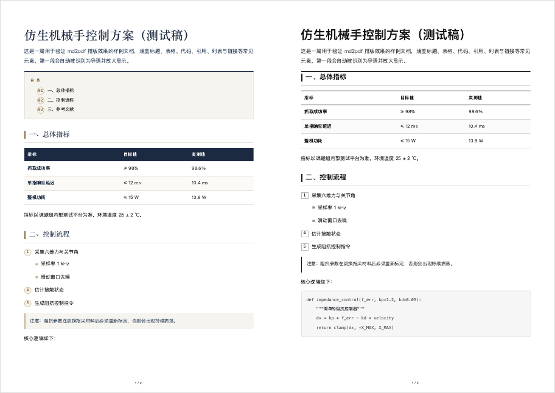

# md2pdf

把 Markdown 排成**优雅的中文 A4 PDF**：报头大标题、元信息条、精心排过的表格/代码/引用/列表、页脚页码。
不是 pandoc 的默认样式 —— 是可以直接拿去打印、发给别人看的版式。



仓库：https://cnb.cool/jiyeqian/md2pdf

## 安装

```bash
git clone https://cnb.cool/jiyeqian/md2pdf.git
cd md2pdf
./install.sh          # 把 bin/md2pdf 软链到 /usr/local/bin（无权限时自动用 ~/.local/bin）
```

装完会检查 Node 与 Chrome，缺什么会直接告诉你。验证：

```bash
md2pdf examples/demo.md --open
```

卸载：`./uninstall.sh`（只删软链，项目文件保留）。

### 依赖

| 依赖 | 要求 | 说明 |
| --- | --- | --- |
| Node.js | ≥ 18（建议 ≥ 22） | < 22 时自动启用内置 WebSocket 实现；`MD2PDF_NODE` 可指定 |
| Chrome / Edge / Chromium | 任一 | 只用来渲染，不联网；`MD2PDF_CHROME` 可指定路径 |

零 npm 依赖 —— Markdown 解析器（marked）已内置在 `vendor/`，装好即用。

## 用法

```bash
md2pdf 文件名.md                    # 同目录输出同名 .pdf
md2pdf 文件名.md --open             # 转完直接打开
md2pdf a.md b.md -o 输出目录/       # 批量（共用一个浏览器实例，很快）
md2pdf 文件名.md --theme minimal --toc
```

### 选项

| 选项 | 作用 |
| --- | --- |
| `-o, --output <path>` | 输出路径；多文件或目标是目录时，作为输出目录 |
| `--theme <name>` | `elegant`（默认，墨蓝＋古铜）｜ `minimal`（黑白公文风） |
| `--title <text>` | 覆盖标题（默认：正文首个 H1 → frontmatter.title → 文件名） |
| `--kicker <text>` | 报头小标题；`SKILL.md` 默认显示「技能文档」 |
| `--no-meta` | 不要 frontmatter 元信息条 |
| `--no-lead` | 首段不作为导语放大 |
| `-t, --toc` | 生成目录（取自 H2，需 2 个以上） |
| `--link-urls` | 正文链接后附 URL（纸质可读） |
| `--landscape` | 横向页面 |
| `--font-size <pt>` | 正文字号，默认 10.5 |
| `--margin <mm>` | 页边距，默认 20；可写 `"20,18"`（上下,左右） |
| `--no-footer` | 不要页脚页码 |
| `--footer-left / --footer-right <text>` | 页脚左右文字 |
| `--colophon <text>` | 文末落款（默认：来源文件名） |
| `--keep-html` | 保留中间 HTML，方便调样式 |
| `--html-only` | 只生成 HTML，不启动浏览器（调样式 / CI 校验用） |
| `--open` | 完成后打开 PDF |

布尔选项支持 `--flag=false`。环境变量：`MD2PDF_CHROME`、`MD2PDF_NODE`、`MD2PDF_WS=mini`。

## 排版规则

- 首个 H1 提升为报头大标题，正文不再重复；其后的首段自动成为导语。
- YAML frontmatter 的 `name` / `description` 生成元信息条；description 里「适用于…」「不用于…」会自动拆成「适用 / 不适用」两栏。
- H2 自动分节并加色块标记；表格深色表头＋隔行浅底；有序列表用圆形序号。
- 相对路径图片自动解析成绝对地址，能正常进入 PDF。

## 改样式

```
assets/base.css              骨架（占位符 {{PAGE_SIZE}} {{MARGIN_*}} {{FONT_SIZE}}）
assets/theme-elegant.css     墨蓝 + 古铜（默认）
assets/theme-minimal.css     黑白公文
assets/shell.html            页面骨架
```

改完直接重跑命令，不用重启任何东西。

## 它是怎么工作的

```
Markdown ──(marked)──▶ HTML ──(模板+主题 CSS)──▶ 完整 HTML
        ──▶ 无头 Chrome（CDP Page.printToPDF）──▶ PDF
```

选 CDP 而不是 `chrome --print-to-pdf` 的原因：命令行版不支持页眉页脚模板，出不了页码。
`preferCSSPageSize: true` 让页面尺寸/边距完全由 CSS `@page` 控制。

## 校验与 CI

```bash
bash ci/validate.sh        # 本地跑，和 CI 完全同一套检查（约几秒）
```

校验分四层，全部不需要浏览器：

1. **结构**：必需文件齐全、`bin/` 与安装脚本有可执行位、关键文件确实被 git 跟踪
2. **语法**：`sh -n`、`node --check`
3. **一致性**：版本号（package.json ↔ src）；模板占位符 ↔ 替换逻辑双向闭合；
   主题 CSS 里 `var(--x)` 全部有定义；占位符替换必须是全量的
4. **行为**：`--help`/`--version` 冒烟；`examples/demo.md` 端到端渲染到 HTML，
   断言表格、代码块、引用、嵌套列表、目录、链接 URL、分节都在，且无占位符残留
   与 `undefined` 泄漏

最后还有一步**守卫自测**：故意破坏一份副本（塞入未定义的占位符、改错主题变量名、
改乱版本号），断言校验确实会失败 —— 只会"全绿"的校验等于没有校验。

CNB 云原生构建在 push / PR 时跑同一脚本；打 tag 时额外打包 zip 并发 Release
（见 `.cnb.yml`）。

### 发版

改完 `src/md2pdf.mjs` 的 `VERSION` 与 `package.json` 的 `version`（校验会检查两者一致），然后：

```bash
git tag v1.1.1 && git push origin v1.1.1
```

流水线会自动：校验 → `git archive` 打包 `md2pdf-v1.1.1.zip` → 创建 Release → 上传附件。
注意 CNB **不允许删除 tag**，打错了只能升版本号再发一版。

## 目录结构

```
bin/md2pdf            启动器（解析软链、挑选 node）
src/md2pdf.mjs        主程序
src/ws.mjs            Node < 22 时的极简 WebSocket 客户端
assets/               样式与页面骨架
vendor/marked.esm.js  内置 Markdown 解析器
examples/demo.md      示例文档（含表格/代码/引用/嵌套列表）
ci/validate.sh        校验入口（本地与 CI 同一套）
ci/checks.mjs         一致性 + 端到端渲染断言
install.sh uninstall.sh
```

## 常见问题

**找不到 Chrome** → 设 `export MD2PDF_CHROME=/Applications/Google\ Chrome.app/Contents/MacOS/Google\ Chrome`

**Node 版本老** → 升级到 22+；不想升也能用（自动走内置 WebSocket），只是没在老版本上充分测试。

**PDF 里目录不能点击** → Chrome 打印不保留内部锚点跳转，目录是纯文本。

**想改默认字号/边距** → 直接改命令行参数；要永久生效就改 `src/md2pdf.mjs` 里 `parseArgs` 的默认值。

## License

MIT

第三方组件：`vendor/marked.esm.js` 来自 [marked](https://github.com/markedjs/marked)（MIT License），随仓库分发以便零依赖安装。
