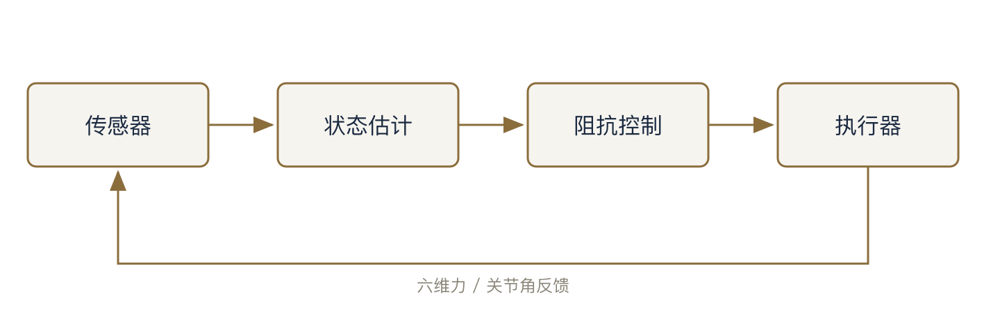
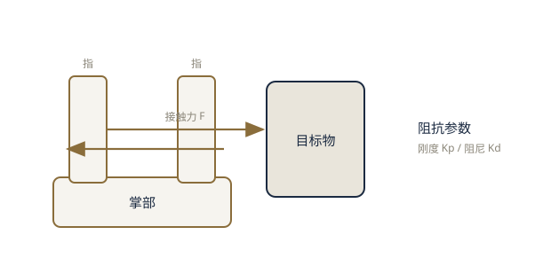

# 仿生机械手控制方案（测试稿）

仿生机械手要在非结构化环境中稳定抓取，核心在于对接触力与关节运动进行实时协调控制[^hogan1985]。本文是 md2pdf 的排版效果样例，涵盖标题层级、表格、代码、引用、列表、链接、数学公式与脚注等常见元素。

## 总体指标

表：仿生机械手主要性能指标 {#tab:metrics}

| 指标 | 目标值 | 实测值 |
| --- | --- | --- |
| 抓取成功率 | ≥ 98% | 98.6% |
| 单指响应延迟 | ≤ 12 ms | 10.4 ms |
| 整机功耗 | ≤ 15 W | 13.8 W |

由表 \ref{tab:metrics} 可见，各项指标均满足设计要求。测试以课题组内部平台为准，环境温度 25 ± 2 ℃。

## 控制流程

抓取过程的状态转移如下：

图：抓取阶段状态转移 {#fig:flow}


控制回路框图如下（栅格图片，相对路径自动解析进 PDF）：



### 感知与采样

按图 \ref{fig:ctrl} 的回路，依次执行：

1. 采集六维力与关节角
   - 采样率 1 kHz
   - 滑动窗口去噪
2. 估计接触状态

采样窗口取 64 点[^window]，在去噪能力与实时性之间取得平衡。

### 阻抗控制

> 注意：阻抗参数在更换指尖材料后必须重新标定，否则会出现持续振荡。



阻抗控制最早由 Hogan 提出，目的是让机械臂在接触环境中表现出期望的“质量—阻尼—刚度”特性[^hogan1985]，其稳定性分析依赖反馈系统理论[^astrom2008]。

机械手的关节动力学与阻抗控制律可合并写成如下方程组：

$$
\begin{aligned}
M(\theta)\,\ddot{\theta} + C(\theta,\dot{\theta})\,\dot{\theta} + G(\theta) &= \tau, \\
\tau &= K_p\,(\theta_d - \theta) + K_d\,(\dot{\theta}_d - \dot{\theta}),
\end{aligned}
\label{eq:ctrl}
$$

其中 $M$ 为惯性矩阵，$C$ 为科氏—离心项，$G$ 为重力项，$K_p$、$K_d$ 分别为刚度与阻尼系数。将式 $\eqref{eq:ctrl}$ 的控制律代入动力学，令误差 $e = \theta - \theta_d$，可得闭环误差方程：

$$
M(\theta)\,\ddot{e} + \bigl[\,C(\theta,\dot{\theta}) + K_d\,\bigr]\,\dot{e} + K_p\,e = 0
\label{eq:err}
$$

由式 $\eqref{eq:err}$ 可见，当 $K_p$、$K_d$ 正定时误差渐进收敛[^astrom2008]。参数整定方法参见文献[^astrom2008]，国内在仿生抓取控制方面的研究进展见文献[^wang2021]，基于学习的灵巧抓取策略见会议论文[^liu2020]。

核心逻辑如下：

```python
def impedance_control(f_err, kp=1.2, kd=0.05):
    """简单的阻抗控制器"""
    dx = kp * f_err - kd * velocity
    return clamp(dx, -X_MAX, X_MAX)
```

## 小结

上述指标、控制流程与参考文献均按标准著录规则自动排版，所用工具 [md2pdf](https://cnb.cool/jiyeqian/md2pdf) 即本项目[^md2pdf]。

[^window]: 采样窗口宽度为经验值；实际部署时须按传感器噪声水平调整，窗口过大会引入额外相位延迟。

[^md2pdf]: @misc{md2pdf,
  author = {Qian, Jiye},
  title = {md2pdf: 优雅的中文 Markdown 转 PDF 工具},
  year = {2026},
  url = {https://cnb.cool/jiyeqian/md2pdf}
  }

[^hogan1985]: @article{hogan1985,
  author = {Hogan, Neville},
  title = {Impedance Control: An Approach to Manipulation},
  journal = {Journal of Dynamic Systems, Measurement, and Control},
  year = {1985},
  volume = {107},
  number = {1},
  pages = {1--24}
  }

[^astrom2008]: @book{astrom2008,
  author = {Åström, Karl Johan and Murray, Richard M.},
  title = {Feedback Systems: An Introduction for Scientists and Engineers},
  publisher = {Princeton University Press},
  address = {Princeton},
  year = {2008}
  }

[^wang2021]: @article{wang2021,
  author = {王伟 and 李强},
  title = {仿生机械手抓取控制研究进展},
  journal = {机械工程学报},
  year = {2021},
  volume = {57},
  number = {12},
  pages = {1--15}
  }

[^liu2020]: @inproceedings{liu2020,
  author = {Liu, Yang and Zhang, Wei},
  title = {Learning-Based Grasping for Dexterous Robotic Hands},
  booktitle = {Proceedings of the IEEE International Conference on Robotics and Automation (ICRA)},
  year = {2020},
  pages = {3120--3127},
  address = {Paris, France}
  }
